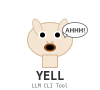

# YELL >�=�

<p align="center">
  
</p>

A terminal LLM client with enhanced editing and output capabilities.

## Features

- **Better Input**: Advanced editing support with `prompt_toolkit`
  - Multiline input with Enter/Shift+Enter keybindings
  - Command completion and history
  - Vi/Emacs-style cursor modes

- **Better Output**: Rich markdown rendering with `rich`
  - Real-time streaming markdown display
  - Multiple output formats (plain, markdown, streamdown)
  - Syntax highlighting and formatting

- **LLM Integration**: Built on the `llm` library
  - Support for multiple providers (Anthropic, Gemini, etc.)
  - Conversation persistence and resumption
  - Fragment and attachment support

## Installation

### Quick Try
```bash
uvx git+https://github.com/yorickvp/yell
```

### Install
```bash
uv tool install git+https://github.com/yorickvp/yell
```

### Setup
You'll need to configure API keys first:
```bash
llm keys set openai
# or
llm keys set anthropic
```

## Usage

Start a new conversation:
```bash
yell
```

### Command Line Options

- `-m, --model MODEL`: Choose LLM model
- `-c, --continue`: Continue last conversation
- `-s, --system TEXT`: Set system prompt
- `--conversation CID`: Resume specific conversation
- `-f, --fragment PATH`: Attach file fragment
- `--sf, --system-fragment PATH`: Attach system fragment
- `-o, --option KEY=VALUE`: Set model options

### Interactive Commands

- `/quit`, `/exit`: Exit the application
- `/model [MODEL]`: Switch model
- `/fragment PATH`: Attach file fragment
- `/options`: Show current model options
- `/format FORMAT`: Change output format (plain/markdown/streamdown)
- `/last`: Show last response

### Examples

```bash
# Start with specific model
yell -m claude-3-5-sonnet-20241022

# Continue previous conversation
yell --continue

# Set system prompt and attach code file
yell -s "You are a code reviewer" -f main.py

# Use custom model options
yell -m gpt-4 -o temperature=0.7 -o max_tokens=2000
```

## Output Formats

- **markdown** (default): Rich rendering with syntax highlighting
- **plain**: Simple text output
- **streamdown**: External streamdown renderer

## Dependencies

- **prompt_toolkit**: Advanced terminal input handling
- **rich**: Rich text and markdown rendering
- **llm**: LLM provider abstraction
- **typer**: CLI framework
- **sqlite-utils**: Conversation storage

## Development

```bash
git clone https://github.com/yorickvp/yell.git
cd yell
uv sync

# Run linting
uv run ruff check
uv run pyright

# Format code
uv run ruff format
```